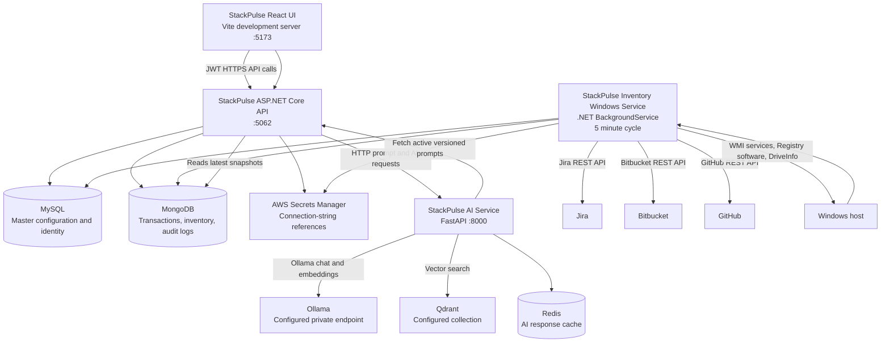

# StackPulse Architecture

This diagram reflects the currently implemented application topology. Install a Mermaid preview extension in VS Code to render it.

## Current Data Flow

1. The Windows background worker runs every five minutes and runs integration synchronization only. It does not require a computer-master record.
2. The worker polls configured Jira, Bitbucket, and GitHub endpoints and writes completed integration snapshots to MongoDB, including successful empty results.
3. The API authenticates users, serves dashboard and integration data, reads MySQL master configuration, and reads MongoDB operational snapshots.
4. The AI service retrieves the active versioned prompt from the API, creates embeddings through Ollama, searches Qdrant, and generates structured analysis through Ollama. Redis caches dashboard responses.
5. The React UI calls the authenticated API and presents dashboard, integration, inventory, and configuration views.

## Worker Coverage

Implemented: Jira issue polling, Bitbucket open pull-request polling, GitHub open pull-request polling, MongoDB persistence, MySQL computer/integration lookup, `localhost` computer alias matching, and five-minute scheduling.

Not yet implemented: CPU, memory, process, network, ports, uptime, Confluence, GitHub Actions checks, GitHub security findings, vulnerability scanning, change detection, comment posting, notification delivery, and incident correlation.
